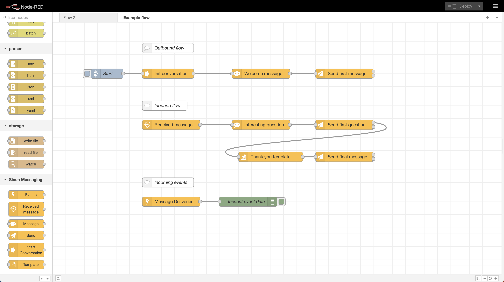

# node-red-contrib-sinch-conversation-api

A package of nodes for [Node-RED](https://nodered.org) which allows you to connect, send and receive messages through the Sinch Conversation API. For more information about the Sinch Conversation API, which messaging channels it supports and how to get started, see the [documentation](https://developers.sinch.com/docs/conversation/overview/).



## Installation

The first step is to install [Node-RED](https://nodered.org/docs/getting-started/local).

```
$ sudo npm install -g node-red
```

> Compatible with Node-Red version 3.x.x and later

The second step is to install the package. You can either install it directly using the Palette Manager. Instructions can be found here: [Node-RED](https://nodered.org/docs/user-guide/runtime/adding-nodes).

Or install manually using npm:

Navigate to the Node-RED installation and install the package:

```
$ cd ~/.node-red
$ npm install @sinch/node-red-contrib-sinch-conversation-api
```

Run Node-RED locally: 
```
$ node-red
```

This will start a server for Node-RED on [http://127.0.0.1:1880/](http://127.0.0.1:1880/).

If the installation of the node package was successful, the Sinch Messaging nodes should be available in the node palette to the left, under the category "Sinch Messaging". 

## Get started
After you've installed Node-RED and the node-red-contrib-sinch-conversation-api package you can start building your flow. To get you started we provide an example [flows.json](docs/examples/flow.json) containing the essentials for sending and receiving messages. To import the flows.json file, open Node-RED in the brower and select the hamburger menu in the top right corner. Choose "Import" and press "select a file to import". The flow file will then be imported on a tab called "Example flow". 

The flow.json contains three separate example flows. For each of the flows there exists a comment node containing additional information about the configuration required to test it out.

### Testing
If you're running Node-RED locally on localhost and want to test receiving messages and events, we recomend using a tool like [Ngrok](https://ngrok.com/). This tool allow you to expose your localhost to the internet and makes it possible to route callback events to Node-RED. This is also a useful for testing the native Http-in node provided by Node-RED.

## More about the nodes
This package contains the following six nodes:

### Receive message node
Handles incoming messages. Requiers a Conversation API configuration. In most cases the same Conversation API configuration can be reused in the Send and Template nodes.

### Events node
Handles all event triggers that has been configured on the App selected in the Conversation API configuration. One or more events can be selected in the configuration and multiple Events nodes can be configured to listen for the same event. 

### Message node
The Message node only defines the message to be sent unsing the Conversation API. It is often connected to a send node which actually sends the message. The message is configured as a JSON in the format specified in the [Conversation API documentation](https://developers.sinch.com/docs/conversation/message-types/). 

### Template node
The Template node only specifies a template to be sent using the Conversation API. It is often connected to a send node which actually sends the message. Templates are created and edited on the [Sinch Dashboard](https://dashboard.sinch.com/convapi/message-composer).

### Send node
Sends a message that has been configured either in a upstream Message or Template node. It also accepts a message or templateId to be passed on the msg obejct. The recipient for the message can be specified in three ways: 

1. Automatically set if a Receive message node is connected upstream in the flow
2. Automatically set if a Start conversation node is connected upstream in the flow
3. Can me set manually by passing a contact on the msg object.
```
msg.contact = { channelIdentities : { channel: "SMS", identity: "+123123123" } }
```

If the "Await response" is checked the flow will continue when a response arrives from the recipient. Otherwise the flow will continue after the message is sent. If the message fails, the flow will continue from the second output. 

### Start conversation node
Allows easy configuration of the receipient of the message(s) to be sent and variables. 
The recipient is specified by providing one or more channels and identities. For some channels, such as SMS, WhatsApp and RCS, the itentities are phone numbers. The variables can be used if defined in a Message or template node. They are also stored in the conversation API and available throughout the flow on the msg object. 

## Contributing
See, [CONTRIBUTING.md](CONTRIBUTING.md).

## Copyright and license

Copyright Sinch AB, https://sinch.com under the [Apache 2.0 license](LICENSE).